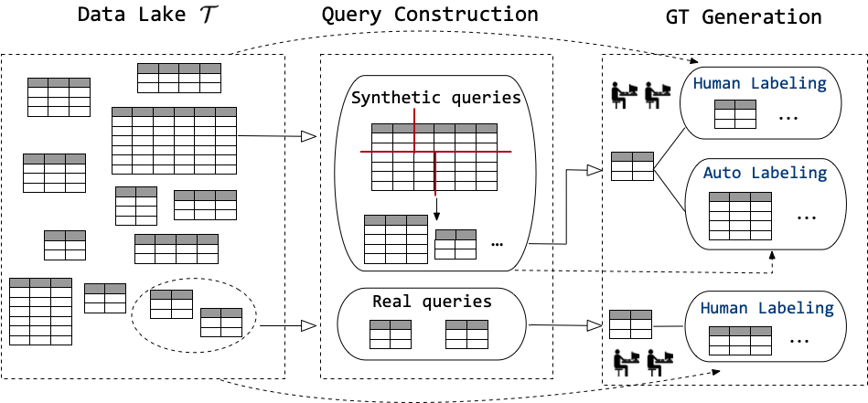
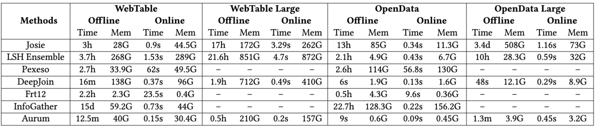
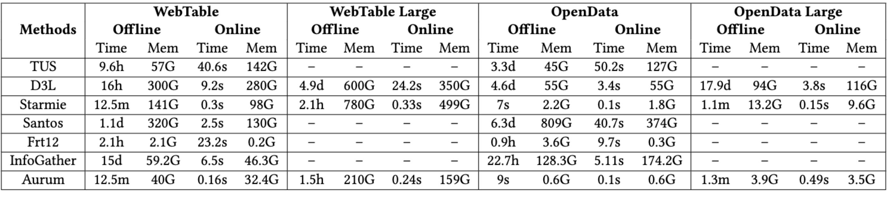

<div align= "center">
    <h1> LakeBench: A Benchmark for Discovering Joinable and Unionable Tables in Data Lakes</h1>
</div>
<p align="center">
  <a href="#-community">Community</a> •
  <a href="#-struct">Folder Structure</a> •
  <a href="#-getstart">GettingStart</a> •
  <a href="#-quickstart">QuickStart</a> •
  <a href="#-result">Result</a> •
</p>


<br>

<div align="center">

</div>
<br>

🌊  LakeBench is a a large-scale benchmark designed to test the mettle of *table discovery* methods on a much larger scale, providing a more comprehensive and realistic evaluation platform for the field, including *finance, retail, manufacturing, energy, media, and more.*

  Despite their paramount significance, existing benchmarks for evaluating and supporting *table discovery* processes have been limited in scale and diversity, often constrained by small dataset sizes. They are not sufficient to systematically evaluate the effectiveness, scalability, and efficiency of various solutions.

  LakeBench consists of over 16 million real tables **–1,600X** larger than existing data lakes, frommultiple sources, with an overall size larger than 1TB (**100X** larger). LakeBench contains both synthesized and real queries, in total more than 10 thousand queries –**10X** more than existing benchmarks, for join and union search respectively. 

🙌  With LakeBench, we thoroughly evaluate the state-of-the-art *table discovery* approaches on our benchmark and present our experimental findings from diverse perspectives, which we believe can push the research of *table discovery*.

<span id="-community"></span>

## 👫 Community

We deeply appreciate the invaluable effort contributed by our dedicated team of developers, supportive users, and esteemed industry partners.

- [Massachusetts Institute of Technology](https://www.mit.edu/)
- [Beijing Institute of Technology](https://english.bit.edu.cn/)
- [Hong Kong University of Science and Technology](https://www.hkust-gz.edu.cn/)
- [Apache Flink](https://flink.apache.org/)
- [Intel](https://www.intel.com/)

<span id="-struct"></span>

## 📧 Folder Structure


```
.
├─── imgs                    # picture of different experiments
├─── join                    # join algorithms                
| ├─── Joise 
| ├─── LSH
| ├─── Pexeso         
| └─── DeepJoin         
| 
├─── union                   # union algorithms                
| ├─── TUS 
| ├─── D3L
| ├─── Santos         
| └─── Starmie  
| 
├─── join&union              # join&union algorithms               
| ├─── Joise 
| ├─── LSH
| ├─── Pexeso         
| └─── DeepJoin 
| 
├─── README.md
└─── requirements.txt
```

<br>


<span id="-getstart"></span>

## 🐳 Getting Started

This is an example of how to set up LakeBench locally. To get a local copy up, running follow these simple example steps.

### Prerequisites

LakeBench is bulit on pytorch, with torchvision, torchaudio, and transfrmers.

To insall the required packages, you can create a conda environmennt:

```sh
conda create --name lakebench python=3.
```

then use pip to install -r requirements.txt

```sh
pip install -r requirements.txt
```

From now on, you can start use LakeBench by typing 

```sh
python test.py
```

### Prepare Datasets

The detailed instructions for downloading and processing are shown in <a href = "#-table_dataset">table</a> below. Please follow it to download datasets/queries before running or developing algorithms.

<div id="-table_dataset"></div> 

|                 Datasets                    | Queries | Ground Truth |
| :-----------------------------------------: | :-----------------------------------------: | :-----------------------------------------: |
|        [WebTable](https://drive.google.com/file/d/1tnI2EyrYHlc3fpv0SSMoe2sqWQZoOEjg/view?usp=drive_link)     |  [WebTable_Union_Query](https://drive.google.com/file/d/16VHNC8vvs3pE5ldrWyQzOKe6VkYVcIP8/view?usp=drive_link)     |  [WebTable_Union_Groun_Truth](https://drive.google.com/file/d/1P0au83zifpAn23xwFlDMV9azTBY-GgZz/view?usp=drive_link)     | 
|       [OpenData_SG](https://drive.google.com/file/d/1pPKMJ2Xnd6gYtkT_zVHIHCC97K5Yib4e/view?usp=drive_link)       |   [WebTable_Join_Query](https://drive.google.com/file/d/19YUPS2OsDQBmfR1ITtoKGvaIX4TO1pgg/view?usp=drive_link)       |    [WebTable_Join_Groun_Truth](https://drive.google.com/file/d/1wmh1qKRVGZ6zA4tEvwttnK9HdFpvbATs/view?usp=drive_link)       |  
|       [OpenData_CAN](https://drive.google.com/file/d/1ksOyaGVugeu7UJ0SKbYj4ri-rwgGfNH8/view?usp=drive_link)       |    [OpenData_Union_Query](https://drive.google.com/file/d/1SJ-SDOTkFyIfkHewVK-LDov3vrQdW9O4/view?usp=drive_link)       |  [OpenData_Union_Groun_Truth](https://drive.google.com/file/d/1_Bu5tw4Ou6yAO4DbE7x-wXUJ39pR2djv/view?usp=drive_link)       |  
|       [OpenData_UK、OpenData_USA](https://drive.google.com/drive/folders/1F9hIN815B6jmn85t-4gQGDoV-gLX8QvH?usp=drive_link)       |    [OpenData_Join_Query](https://drive.google.com/file/d/1em6YDiG311GfW2Inpxh7SomBA-zaLcmO/view?usp=drive_link)       |   [OpenData_Join_Groun_Truth](https://drive.google.com/file/d/16j_ZyHEFjYDiaTNSTbF8I-t1kNFtQWJ1/view?usp=drive_link)       |   

<span id="-quickstart"></span>

## 🐠 Quick Start

LakeBench is easy to use and extend. Going through the bellowing examples will help you familiar with LakeBench for quick use, evaluate an existing join/union algorithm on your own dataset, or developing new join/union algorithms.

### Train

Here is an example to train Starmie on *Webtable*. Training other supported algorithms (on other datasets with different query) can be specified by the <a href = "#-table">table</a> below.

**Step1: Check your environment**

You need to properly install nvidia driver first. To use GPU in a docker container You also need to install nvidia-docker2 ([Installation Guide](https://docs.nvidia.com/datacenter/cloud-native/container-toolkit/install-guide.html#docker)). Then, Please check your CUDA version via `nvidia-smi`

**Step2: Pretrain**

```sh
python pretrain.py --task webtable
```

**Step3: Indexing**

```sh
python index.py --benchmark webtable
```

**Step4: Querying**

```sh
python query.py --benchmark webtable --K 5 --N 10 --threshold 0.7
```

If you want to try other algorithms, you can read more details according to the table:

<div id="-table"></div> 

|                 Algorithms                  |     Task     |                            Train                             |
| :-----------------------------------------: | :----------: | :----------------------------------------------------------: |
|        [Joise](join/Joise/joise.md)         |     Join     |         [./join/Joise/joise.md](join/Joise/joise.md)         |
|       [LSH Ensemble](join/LSH/lsh.md)       |     Join     |             [./join/LSH/lsh.md](join/LSH/lsh.md)             |
|       [Pexeso](join/Pexeso/pexeso.md)       |     Join     |       [./join/Pexeso/pexeso.md](join/Pexeso/pexeso.md)       |
|    [DeepJoin](join/Deepjoin/deepjoin.md)    |     Join     |   [./join/Deepjoin/deepjoin.md](join/Deepjoin/deepjoin.md)   |
|           [TUS](union/TUS/tus.md)           |    Union     |            [./union/TUS/tus.md](union/TUS/tus.md)            |
|           [D3L](union/D3L/d3l.md)           |    Union     |            [./union/D3L/d3l.md](union/D3L/d3l.md)            |
|      [Santos](union/Santos/santos.md)       |    Union     |      [./union/Santos/santos.md](union/Santos/santos.md)      |
|     [Starmie](union/Starmie/starmie.md)     |    Union     |    [./union/Starmie/starmie.md](union/Starmie/starmie.md)    |
|      [Frt12](join&union/Frt12/frt.md)       | Join & Union |     [./join&union/Frt12/frt.md](join&union/Frt12/frt.md)     |
| [InfoGather](join&union/InfoGather/info.md) | Join & Union | [./join&union/InfoGather/info.md](join&union/InfoGather/info.md) |
|     [Aurum](join&union/Aurum/aurum.md)      | Join & Union |   [./join&union/Aurum/aurum.md](join&union/Aurum/aurum.md)   |


<span id="-result"></span>

<br>

##  🏆  Results


### Efficiency and Memory Usage Reference

Efficiency and Memory Usage of Table Join Search:

<div align="center">

</div>
<br>


Efficiency and Memory Usage of Table Union Search:

<div align="center">

</div>
