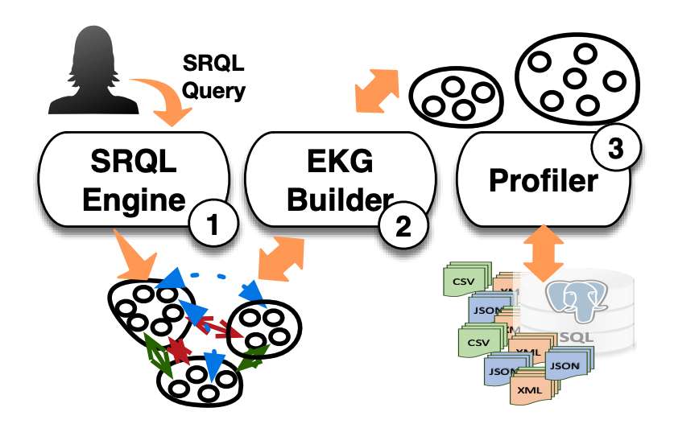

<div>
    <h1>Aurum</h1>
</div>

# Semantics-aware Dataset Discovery from Data Lakes with Contextualized Column-based Representation Learning


<br>

<h2>Folder Structure</h2>

```
.
├─── build_hash.py             # build the minhash of each column
├─── query.py                  # Get the union results                         
├─── hnsw_search.py     
└─── aurum.md
```

<br>

<h2>Quik Start</h2>

**Step1: Check your environment**

You need to properly install python package first. Please check package you have installed via `pip list`

**Step2: build minhash**

Here are some parameters:

> -- task [choose task, str] [opendata, opendata_large, webtable, webtable_large]

```sh
python build_hash.py --task webtable
```

**Step3: Querying**

> --benchmark [choose benchmark, str] [opendata, opendata_large, webtable, webtable_large]
>
> --K [choose top-$k$ ,int] [5~30]
>
> --threshold [choose threshold, float] [0.5~0.9]
>
> --N [choose N, int] [4, 10, 16, 25, 50]

```sh
python query.py --benchmark webtable --K 5 --N 10 --threshold 0.7
``