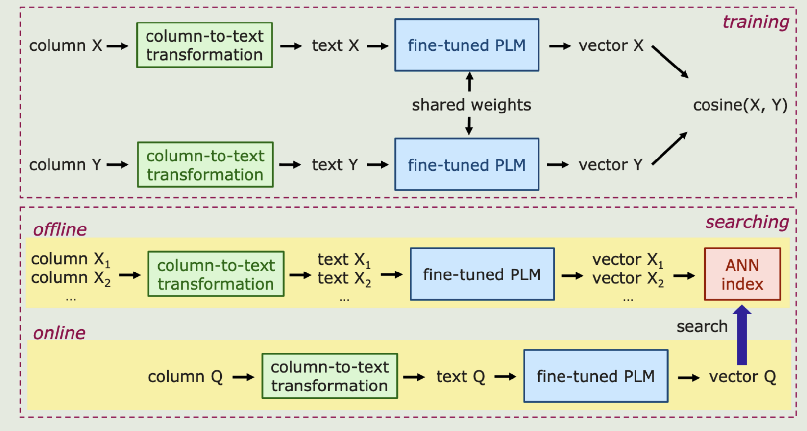

<div align= "center">
    <h1> DeepJoin: Joinable Table Discovery with Pre-trained Language Models</h1>
</div>
<p align="center">
  <a href="#-community">Community</a> •
  <a href="#-struct">Folder Structure</a> •
  <a href="#-getstart">GettingStart</a> •
  <a href="#-quickstart">QuickStart</a> •
  <a href="#-result">Result</a> •
</p>


<br>

<div align="center">

</div>
<br>

🌊  Our solution is an embeddingbased retrieval, which employs a pre-trained language model (PLM) and is designed as one framework serving both equi- and semantic (with a similarity condition on word embeddings) joins for textual attributes with fairly small cardinalities. We propose a set of contextualization options to transform column contents to a text sequence. The PLM reads the sequence and is fine-tuned to embed columns to vectors such that columns are expected to be joinable if they are close to each other in the vector space. Since the output of the PLM is fixed in length, the subsequent search procedure becomes independent of the column size. With a state-of-the-art approximate nearest neighbor search algorithm, the search time is sublinear in the repository size. To train the model, we devise the techniques for preparing training data as well as data augmentation. The experiments on real datasets demonstrate that by training on a small subset of a corpus, DeepJoin generalizes to large datasets and its precision consistently outperforms other approximate solutions'.DeepJoin is even more accurate than an exact solution to semantic joins when evaluated with labels from experts. Moreover, when equipped with a GPU, DeepJoin is up to two orders of magnitude faster than existing solutions
<span id="-community"></span>

## 👫 Community

We deeply appreciate the invaluable effort contributed by our dedicated team of developers, supportive users, and esteemed industry partners.

- [Massachusetts Institute of Technology](https://www.mit.edu/)
- [Beijing Institute of Technology](https://english.bit.edu.cn/)
- [Hong Kong University of Science and Technology](https://www.hkust-gz.edu.cn/)
- [Apache Flink](https://flink.apache.org/)
- [Intel](https://www.intel.com/)

<span id="-struct"></span>

## 📧 Folder Structure


```
.
├─── img                    # picture of different experiments
├─── all-mpnet-base-v2      #model name because this file is too large  it is not uploaded ,but you can download it from    https://huggingface.co/sentence-transformers/all-mpnet-base-v2                     
| 
├─── datapreocess           # process data                
| ├─── dataset_to_sentences.py 
| ├─── multi_process_csv.py
| ├─── process_table_tosentence.py         
|   
| 
├─── join             # join algorithms               
| ├─── deepjoin_train.py
| ├─── deepjoin_infer.py
```

<br>


<span id="-getstart"></span>

## 🐳 Getting Started

This is an example of how to set up deepjoin locally. To get a local copy up, running follow these simple example steps.

### Prerequisites

Deepjoin is bulit on pytorch, with torchvision, torchaudio, and transfrmers.

To insall the required packages, you can create a conda environmennt:

```sh
conda create --name deepjoin_env python=3.
```

then use pip to install -r requirements.txt

```sh
pip install -r requirements.txt
```


<span id="-quickstart"></span>

## 🐠 Instruction

Deepjoin is easy to use and extend. Going through the bellowing examples will help you familiar with Deepjoin for detailed instructions, evaluate an existing join/union algorithm on your own dataset, or developing new join/union algorithms.

**Step1: Check your environment**

You need to properly install nvidia driver first. To use GPU in a docker container You also need to install nvidia-docker2 ([Installation Guide](https://docs.nvidia.com/datacenter/cloud-native/container-toolkit/install-guide.html#docker)). Then, Please check your CUDA version via `nvidia-smi`

**Step2: Pretrain**

```sh
python deepjoin_train.py --dataset opendata --opendata all-mpnet-base-v2 --model_save_path /deepjoin/model/output  
-- dataset [choose task, str] [opendata, webtable]
--opendata [train_model name str] [all-mpnet-base-v2]
--model_save_path [trained_model_save_path,str]
--file_train_path [pretain_file_path,str]
--train_csv_file [pretrain_file path str]
--storepath [pretrain index store path str]
```

**Step3: infer**

```sh
python deepjoin_infer.py 
-- dataset [choose task, str] [opendata, webtable]
--datafile [infer_tables_file ,str]
--storepath [final_reslut_storepath,str]
```

**Step4: Indexing**

Here are some parameters:

> --benchmark [Choose benchmark, str] [opendata, opendata_large, webtable, webtable_large]

```sh
python index.py --benchmark webtable
```

**Step5: Querying**

> --benchmark [Choose benchmark, str] [opendata, opendata_large, webtable, webtable_large]
>
> --K [Choose top-*k* ,int] [5~60]
>
> --threshold [Choose threshold, float] [0.5~1.0]
>
> --N [Choose N, int] [4, 10, 16, 25, 50]

```sh
python query.py --benchmark webtable --K 5 --N 10 --threshold 0.7
```

<br>
